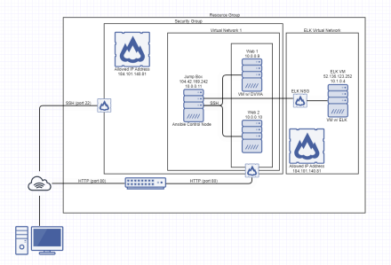
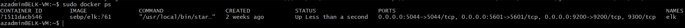

## Automated ELK Stack Deployment

The files in this repository were used to configure the network depicted below.

These files have been tested and used to generate a live ELK deployment on Azure. They can be used to either recreate the entire deployment pictured above. Alternatively, select portions of the YAML file may be used to install only certain pieces of it, such as Filebeat.

  - install-elk.yml

This document contains the following details:
- Description of the Topologu
- Access Policies
- ELK Configuration
  - Beats in Use
  - Machines Being Monitored
- How to Use the Ansible Build

### Description of the Topology

The main purpose of this network is to expose a load-balanced and monitored instance of DVWA, the D*mn Vulnerable Web Application.

Load balancing ensures that the application will be highly REGULATED, in addition to restricting ACCESS to the network.
- Load Balancers protect the flow of traffic through your network in order to regulate and prevent DDoS attacks. A Jump Box allows people to connect to a secured machine on an organization before moving through the network.

Integrating an ELK server allows users to easily monitor the vulnerable VMs for changes to the LOGS and system TRAFFIC.
- Filebeat watches for changes in log files or file destinations that you specify.
- Metricbeat records metrics and statistics from the OS and services running on your server.

The configuration details of each machine may be found below.
_Note: Use the [Markdown Table Generator](http://www.tablesgenerator.com/markdown_tables) to add/remove values from the table_.

| Name     | Function   | IP Address | Operating System |
|----------|------------|------------|------------------|
| Jump Box |  Gateway   | 10.0.0.11  | Linux            |
| Web 1    |Distribution| 10.0.0.9   | Linux            |
| Web 2    |Distribution| 10.0.0.10  | Linux            |
| ELK VM   |  Logging   | 10.1.0.4   | Linux            |

### Access Policies

The machines on the internal network are not exposed to the public Internet. 

Only the JUMP BOX machine can accept connections from the Internet. Access to this machine is only allowed from the following IP addresses:
- 184.101.76.123

Machines within the network can only be accessed by SSH.
- The Jump Box machine is the allowed connection to the ELK VM. The Jump Box machine has the IP Address of 104.42.169.242, which in turn only allows connection to the ELK VM using the IP address 184.101.76.123.

A summary of the access policies in place can be found in the table below.

| Name     | Publicly Accessible | Allowed IP Addresses     |
|----------|---------------------|--------------------------|
| Jump Box | Yes                 | 184.101.76.123           |
| Web 1    | No                  | 184.101.76.123 10.0.0.11 |
| Web 2    | No                  | 184.101.76.123 10.0.0.11 |

### Elk Configuration

Ansible was used to automate configuration of the ELK machine. No configuration was performed manually, which is advantageous because...
- Its time efficient and is easily repeatable.

The playbook implements the following tasks:
- Installs Docker
- Installs Python
- Increases virtual memory
- Assigns increased memory
- Downloads and launches docker elk container

The following screenshot displays the result of running `docker ps` after successfully configuring the ELK instance.

### Target Machines & Beats
This ELK server is configured to monitor the following machines:
- 10.0.0.9 (Web 1)
- 10.0.0.10 (Web 2)

We have installed the following Beats on these machines:
- Filebeat
- Metricbeat

These Beats allow us to collect the following information from each machine:
- Filebeat collects data based on changes in specified log files and/or file locations. With filebeat you would expect to see the changes that were made to the log file or file location that you specified.
- Metricbeat is used to record the metrics and statistics from the services running on your server as well as from the the Operating System. For example if a particulate system of operation is malfunctioning, it will throw an error and metricbeat would identify what caused the error and where it is located.

### Using the Playbook
In order to use the playbook, you will need to have an Ansible control node already configured. Assuming you have such a control node provisioned: 

SSH into the control node and follow the steps below:
- Copy the Filebeat Configuration file to your WebVMs.
- Update the configuration file to include the IP Address of your ELK machine.
- Run the playbook, and navigate to the ELK Server GUI to check that the installation worked as expected.

_TODO: Answer the following questions to fill in the blanks:_
- _Which file is the playbook? Where do you copy it?_
- _Which file do you update to make Ansible run the playbook on a specific machine? How do I specify which machine to install the ELK server on versus which to install Filebeat on?_
- _Which URL do you navigate to in order to check that the ELK server is running?

_As a **Bonus**, provide the specific commands the user will need to run to download the playbook, update the files, etc._

curl -L -O https://artifacts.elastic.co/downloads/beats/filebeat/filebeat-7.6.1-amd64.deb
dpkg -i filebeat-7.4.0-amd64.deb
filebeat modules enable system
filebeat setup
filebeat -e
