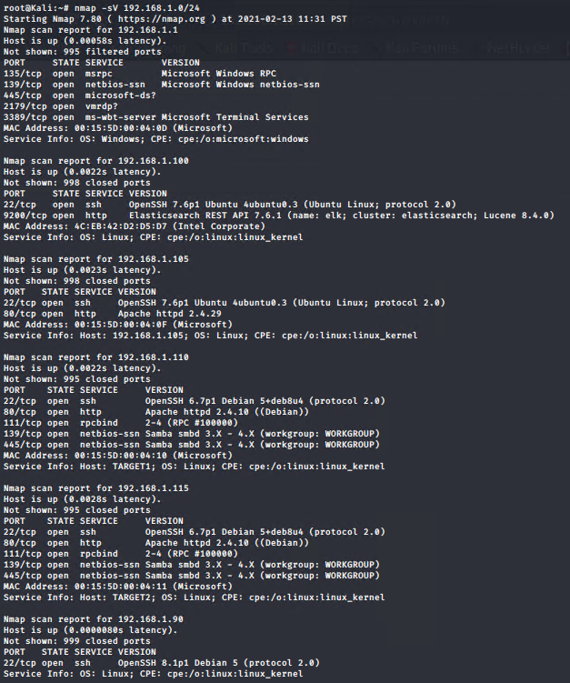
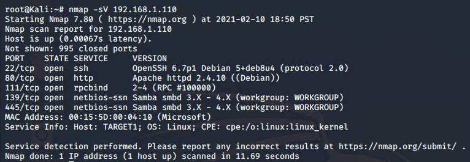

# Red Team: Summary of Operations

## Table of Contents
- Exposed Services
- Critical Vulnerabilities
- Exploitation

### Exposed Services

Nmap scan results for each machine reveal the below services and OS details:

$ nmap -sV 192.168.1.0/24

$ nmap -sV 192.168.1.110

This scan identifies the services below as potential points of entry:
- Target 1
  - ssh
  - http
  - rpcbind
  - netbios-ssn

The following vulnerabilities were identified on each target:
- Target 1
  - OpenSSH
  - Wordpress Enumeration
  - SQL database access
  - root access with python

### Exploitation

The Red Team was able to penetrate `Target 1` and retrieve the following confidential data:
- Target 1
  - `flag1`: b9bbcb33e11b80be759c4e844862482d
    - **Exploit Used**
      - We were able to view the page source of the target 1 website and find the hash which was correlated to flag1.txt.

  - `flag2`: fc3fd58dcdad9ab23faca6e9a36e581c
    - **Exploit Used**
      - We were able to guess Michael’s password due to the lack of complexity. From there we could easily SSH into the server in which we found the hashes in /var/www directory.

  - `flag3`: afc01ab56b50591e7dccf93122770cd2
    - **Exploit Used**
      - Earlier we found the root credentials which allowed us to use our root access to the mysql database to locate flag3.txt.
      - We ran the following commands in order to find flag3.txt:
            mysql -u root -pR@v3nSecurity
            show databases;
            use wordpress;
            select * from wp_posts WHERE post_status != 'publish';

  - `flag4`: 715dea6c055b9fe3337544932f2941ce
    - **Exploit Used**
      - We were able to escalate our privileges to root using a python script that was found while logged in as steven. 
      - From there we ran the command 'sudo -l' to list the sudoers which tells us where sudo can be run.
      - Then we ran the command sudo 'python -c ‘import pty;pty.spawn(“/bin/bash”)’' and then 'id' to make sure we are logged in as root. 

