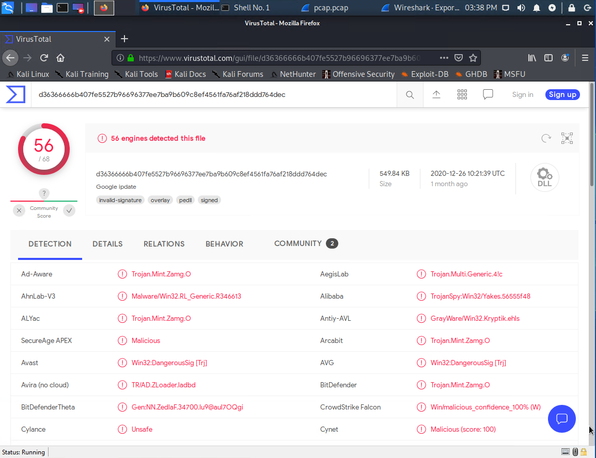

# Red Team: Summary of Operations

## Table of Contents
- Exposed Services
- Critical Vulnerabilities
- Exploitation

### Exposed Services

Nmap scan results for each machine reveal the below services and OS details:

$ nmap -sV 192.168.1.0/24

$ nmap -sV 192.168.1.110

This scan identifies the services below as potential points of entry:
- Target 1
  - ssh
  - http
  - rpcbind
  - netbios-ssn

The following vulnerabilities were identified on each target:
- Target 1
  - OpenSSH
  - Wordpress Enumeration
  - SQL database access
  - root access with python

### Exploitation

The Red Team was able to penetrate `Target 1` and retrieve the following confidential data:
- Target 1
  - `flag1`: b9bbcb33e11b80be759c4e844862482d
    - **Exploit Used**
      - We were able to view the page source of the target 1 website and find the hash which was correlated to flag1.txt.

  - `flag2`: fc3fd58dcdad9ab23faca6e9a36e581c
    - **Exploit Used**
      - We were able to guess Michael’s password due to the lack of complexity. From there we could easily SSH into the server in which we found the hashes in /var/www directory.

  - `flag3`: afc01ab56b50591e7dccf93122770cd2
    - **Exploit Used**
      - Earlier we found the root credentials which allowed us to use our root access to the mysql database to locate flag3.txt.
      - We ran the following commands in order to find flag3.txt:
            mysql -u root -pR@v3nSecurity
            show databases;
            use wordpress;
            select * from wp_posts WHERE post_status != 'publish';

  - `flag4`: 715dea6c055b9fe3337544932f2941ce
    - **Exploit Used**
      - We were able to escalate our privileges to root using a python script that was found while logged in as steven. 
      - From there we ran the command 'sudo -l' to list the sudoers which tells us where sudo can be run.
      - Then we ran the command sudo 'python -c ‘import pty;pty.spawn(“/bin/bash”)’' and then 'id' to make sure we are logged in as root. 

------------------------------------------------------------------------------------------------------------------------------------------------------------------------------------------------------------------------

# Blue Team: Summary of Operations

## Table of Contents
- Network Topology
- Description of Targets
- Monitoring the Targets
- Patterns of Traffic & Behavior
- Suggestions for Going Further

### Network Topology

The following machines were identified on the network:
- Name of VM 1
  - **Operating System**: Kali Linux  
  - **Purpose**: Attacker
  - **IP Address**: 192.168.1.90
- Name of VM 2
  - **Operating System**: Ubuntu Linux
  - **Purpose**: Target 1
  - **IP Address**: 192.168.1.110

### Description of Targets

The target of this attack was: `Target 1` (192.168.1.110).

Target 1 is an Apache web server and has SSH enabled, so ports 80 and 22 are possible ports of entry for attackers. As such, the following alerts have been implemented:

### Monitoring the Targets

Traffic to these services should be carefully monitored. To this end, we have implemented the alerts below:

#### Excessive HTTP Errors
Alert 1 is implemented as follows:
  - **Metric**: Any http.response.status.code request ABOVE 400 in the last 5 minutes.
  - **Threshold**: Excessive 400> client side error messages.
  - **Vulnerability Mitigated**: This can potentially flag DoS attacks due to excessive requests
  - **Reliability**: This is considered a medium reliability alert due to false positives. There can potentially be excessive client side user errors creating these alerts. 

#### HTTP Request Size Monitor
Alert 2 is implemented as follows:
  - **Metric**: Any sum of http.request.bytes over all documents being above 3500 for the last 1 minute. 
  - **Threshold**: Maximum request queue length and cannot process any additional requests.
  - **Vulnerability Mitigated**: This can potentially flag attempted XSS attacks. 
  - **Reliability**: This is considered a high reliability alert due to potentially blocking a large payload request.

#### CPU Usage Monitor
Alert 3 is implemented as follows:
  - **Metric**: CPU packets over 0.5 lasting longer than 5 minutes.
  - **Threshold**: This threshold specifies the percentage of CPU resources which will be alerted if surpasses over 0.5%. 
  - **Vulnerability Mitigated**: This can potentially alert us if there is a malicious script running on our computer using excessive resources and slowing down our computers.
  - **Reliability**: This is considered a medium alert only due to the fact that the threshold is very low. Most programs run between 0.5-4.0% CPU usage. We can increase the threshold to 15%+ in order to catch malicious programs. 

------------------------------------------------------------------------------------------------------------------------------------------------------------------------------------------------------------------------

# Network Forensic Analysis Report

Complete this report as you complete the Network Activity on Day 3 of class.

## Time Thieves 
You must inspect your traffic capture to answer the following questions:

1. What is the domain name of the users' custom site? 

http://205.185.125.104/files/june11.dll

2. What is the IP address of the Domain Controller (DC) of the AD network? 

205.185.125.104

3. What is the name of the malware downloaded to the 10.6.12.203 machine? 

june11.dll

4. Upload the file to [VirusTotal.com](https://www.virustotal.com/gui/). 

5. What kind of malware is this classified as? 

Trojan

## Vulnerable Windows Machine

1. Find the following information about the infected Windows machine:
    - Host name: Rotterdam-PC
    - IP address: 172.16.4.205
    - MAC address: 00:59:07:b0:63:a4
    
2. What is the username of the Windows user whose computer is infected?

matthijs.devries

3. What are the IP addresses used in the actual infection traffic?

185.243.115.84 
172.16.4.205
31.7.62.214

## Illegal Downloads

1. Find the following information about the machine with IP address `10.0.0.201`:
    - MAC address: 00:16:17:18:66:c8
    - Windows username: elmer.blanco
    - OS version: Windows 10 64-bit

2. Which torrent file did the user download?

Betty_Boop_Rhythm_on_the_Reservation.avi.torrent