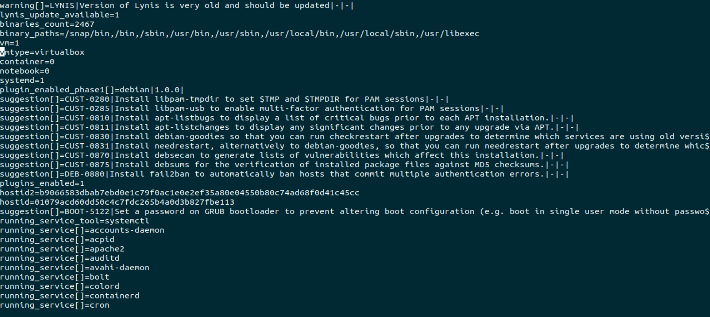
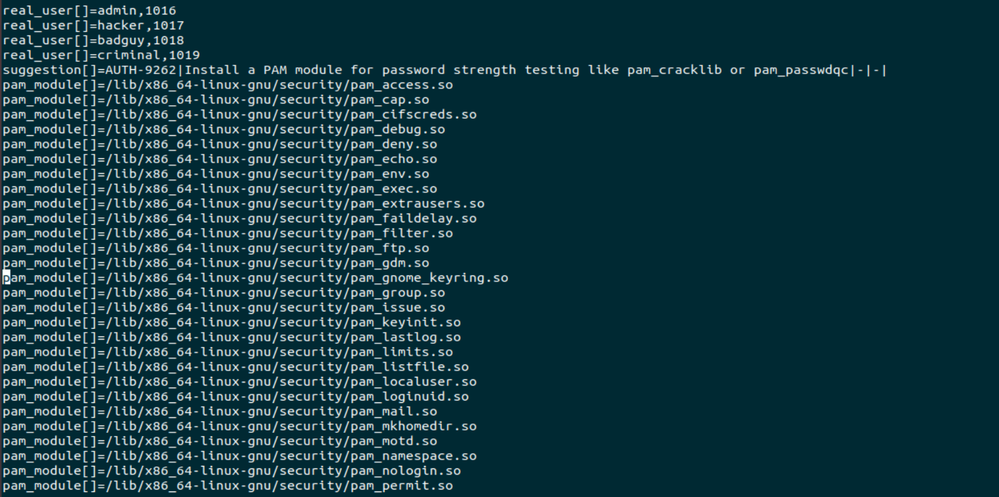
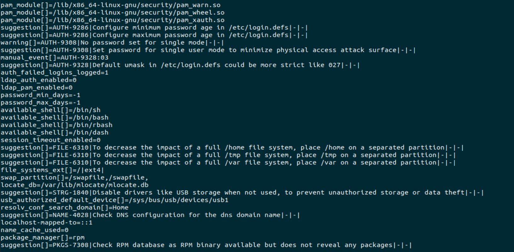
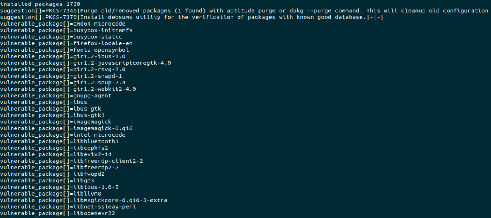
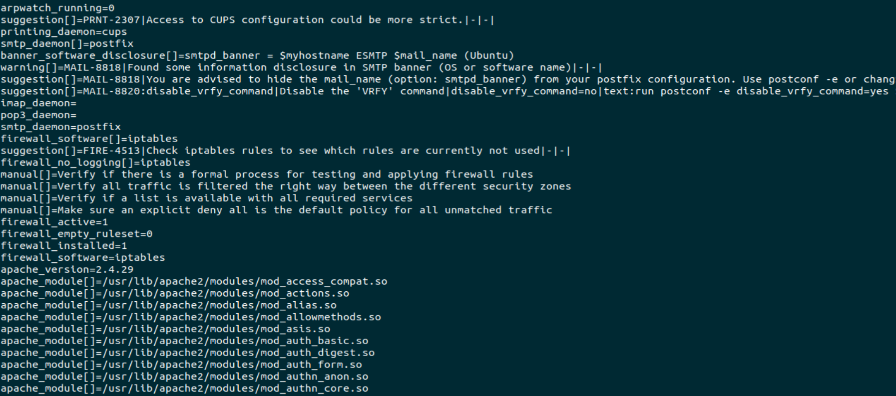
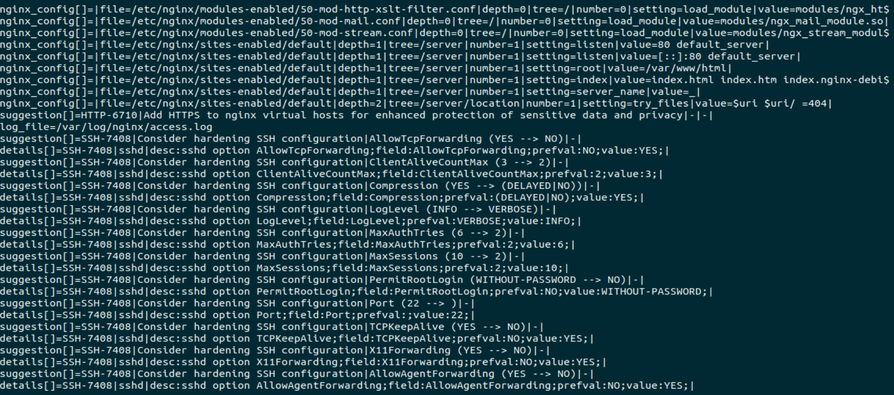
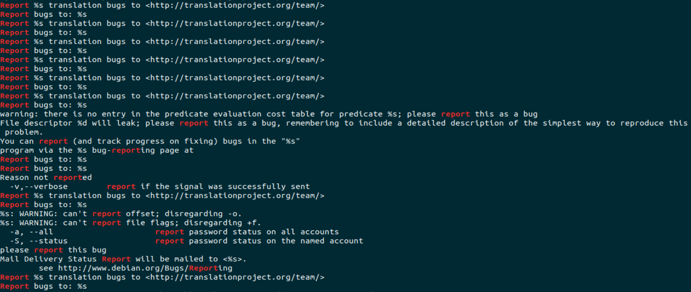

## Week 4 Homework Submission File: Linux Systems Administration

### Step 1: Ensure/Double Check Permissions on Sensitive Files

1. Permissions on `/etc/shadow` should allow only `root` read and write access.

    - Command to inspect permissions:
        ls -l /etc/shadow
    - Command to set permissions (if needed):
        sudo chmod 600 /etc/shadow
2. Permissions on `/etc/gshadow` should allow only `root` read and write access.

    - Command to inspect permissions:
        ls -l /etc/gshadow
    - Command to set permissions (if needed):
        sudo chmod 600 /etc/gshadow
3. Permissions on `/etc/group` should allow `root` read and write access, and allow everyone else read access only.

    - Command to inspect permissions:
        ls -l /etc/group
    - Command to set permissions (if needed):
        sudo chmod 644 /etc/group
4. Permissions on `/etc/passwd` should allow `root` read and write access, and allow everyone else read access only.

    - Command to inspect permissions:
        ls -l /etc/passwd
    - Command to set permissions (if needed):
        sudo chmod 644 /etc/password
### Step 2: Create User Accounts

1. Add user accounts for `sam`, `joe`, `amy`, `sara`, and `admin`.

    - Command to add each user account (include all five users):
        adduser sam
        adduser joe
        adduser amy
        adduser sara
        adduser admin
2. Force users to create 16-character passwords incorporating numbers and symbols.

    - Command to edit `pwquality.conf` file:
        sudo nano /etc/security/pwquality.conf
    - Updates to configuration file:
        uncommented minlen = 0 and changed to minlen = 16
        uncommented dcredit = 0 and changed to dcredit = -1
        uncommented ocredit = 0 and changed to ocredit = -1
3. Force passwords to expire every 90 days.

    - Command to to set each new user's password to expire in 90 days (include all five users): 
        sudo chage -M 90 sam
        sudo chage -M 90 joe
        sudo chage -M 90 amy
        sudo chage -M 90 sara
        sudo chage -M 90 admin
4. Ensure that only the `admin` has general sudo access.

    - Command to add `admin` to the `sudo` group:
        sudo adduser admin sudo
### Step 3: Create User Group and Collaborative Folder

1. Add an `engineers` group to the system.

    - Command to add group:
        groupadd engineers
2. Add users `sam`, `joe`, `amy`, and `sara` to the managed group.

    - Command to add users to `engineers` group (include all four users):
        sudo adduser sam engineers
        sudo adduser joe engineers
        sudo adduser amy engineers
        sudo adduser sara engineers
3. Create a shared folder for this group at `/home/engineers`.

    - Command to create the shared folder:
        sudo mkdir /home/engineers
4. Change ownership on the new engineers' shared folder to the `engineers` group.

    - Command to change ownership of engineer's shared folder to engineer group:
        sudo chown :engineers /home/engineers
5. Add the SGID bit and the sticky bit to allow collaboration between engineers in this directory. 

    - Command to set SGID and sticky bit to shared folder:
        sudo chmod 2775 /home/engineers
        sudo chmod +t /home/engineers

### Step 4: Lynis Auditing

1. Command to install Lynis:
        sudo apt install lynis
2. Command to see documentation and instructions:
        man lynis
        sudo lynis show commands
3. Command to run an audit:
        sudo lynis audit system
4. Provide a report from the Lynis output on what can be done to harden the system.

    - Screenshots of report output:
      
      
      
      
      
      
      

### Bonus
1. Command to install chkrootkit:
    sudo apt install chkrootkit
2. Command to see documentation and instructions:
    man chkrootkit
    chkrootkit -h
3. Command to run expert mode:
    sudo chkrootkit -x
4. Provide a report from the chkrootkit output on what can be done to harden the system.
    - Screenshot of end of sample output:
        http://prntscr.com/umuk6j
---
© 2020 Trilogy Education Services, a 2U, Inc. brand. All Rights Reserved.
